# HR Leave Account Management System (IRCTC)

An enterprise-grade, secure full-stack web application developed for **IRCTC (Indian Railway Catering and Tourism Corporation)** to digitize and automate the lifecycle of employee leave management.

## 🏢 Business Context & Problem Statement
Prior to this system, IRCTC managed employee leave accounts via manual paper registers and fragmented spreadsheets. This approach was highly prone to human error, making it difficult to accurately track cumulative carry-forwards, enforce strict ledger rules (like preventing negative balances for LAP and LHAP), and maintain a secure audit trail of changes. There was a critical need for a centralized platform to automate complex leave calculations securely.

## 🚀 Key Features & Architecture
*   **Automated Strict Ledger**: Designed an automated database ledger that dynamically calculates LAP (Leave on Average Pay) and LHAP balances. The backend strictly prevents negative balances at the PostgreSQL transaction level.
*   **Cumulative Tracking**: Built chronological carry-forward calculations. If historical entries are modified, the system recalculates subsequent balances to maintain absolute ledger integrity.
*   **Secure Role-Based Access Control (RBAC)**: Implemented JWT authentication and bcrypt password hashing, ensuring only authorized HR administrators can modify sensitive records.
*   **Immutable Audit Trail**: An `AuditLog` table immutably tracks all `ADD`, `EDIT`, and `DELETE` actions, ensuring complete accountability for every ledger modification.

## 🛠️ Tech Stack
*   **Frontend:** React.js (Vite), Tailwind CSS, Lucide Icons
*   **Backend:** Python (FastAPI)
*   **Database:** PostgreSQL (SQLAlchemy ORM)
# 🖼 Screenshots

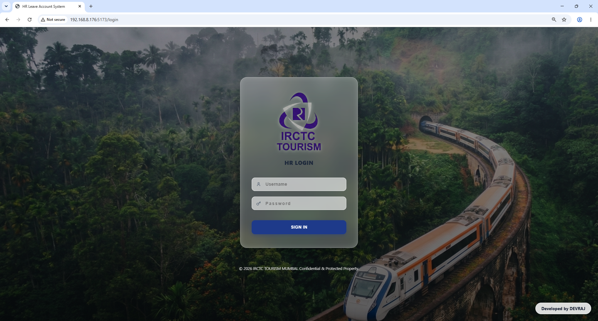
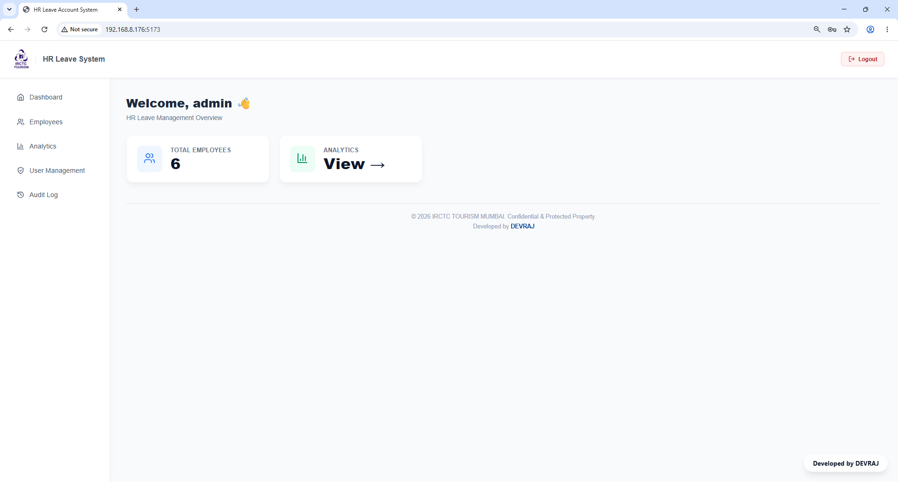
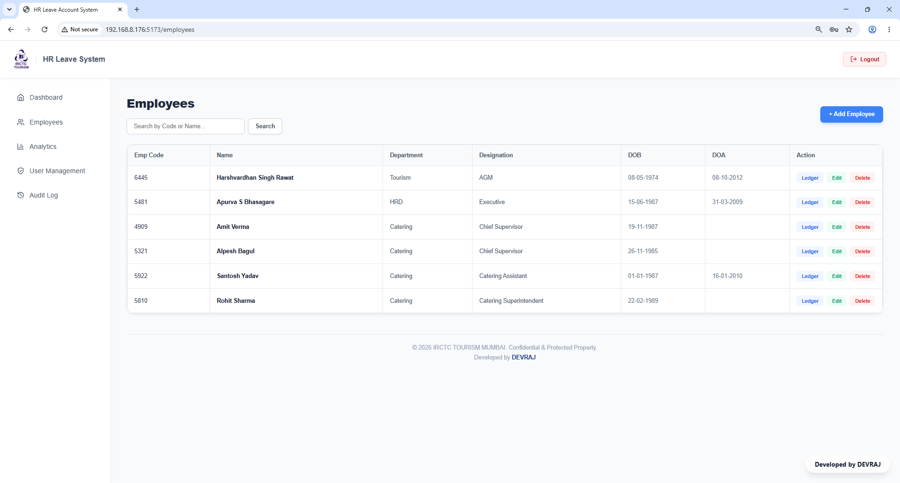
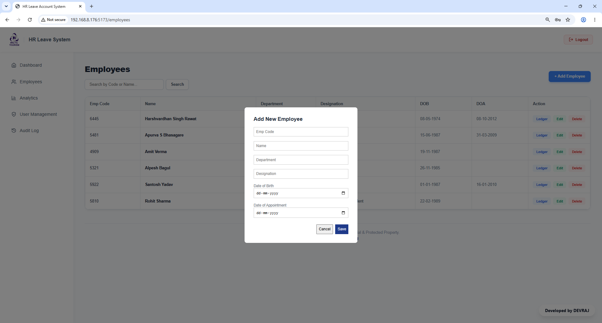
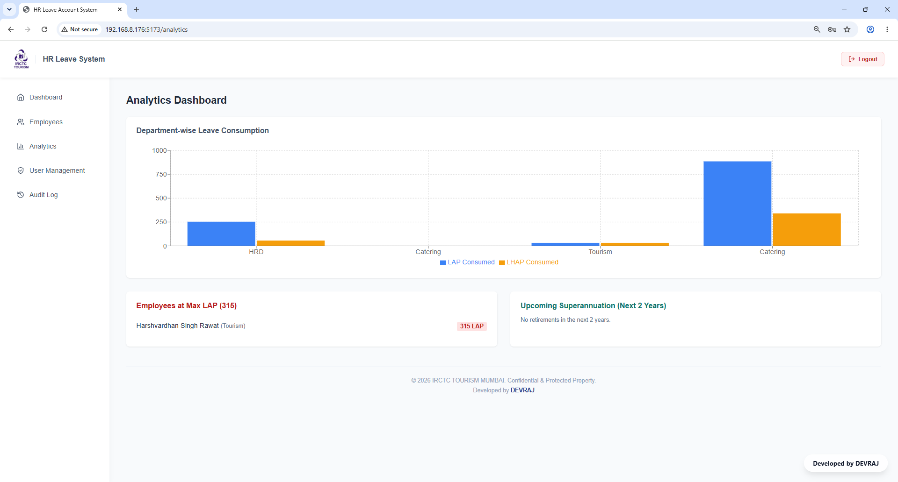
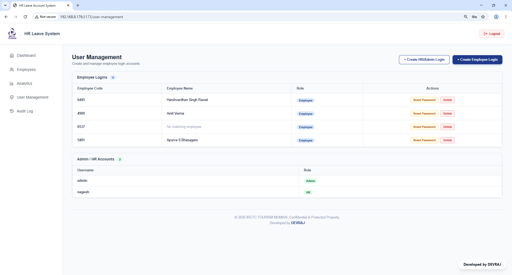
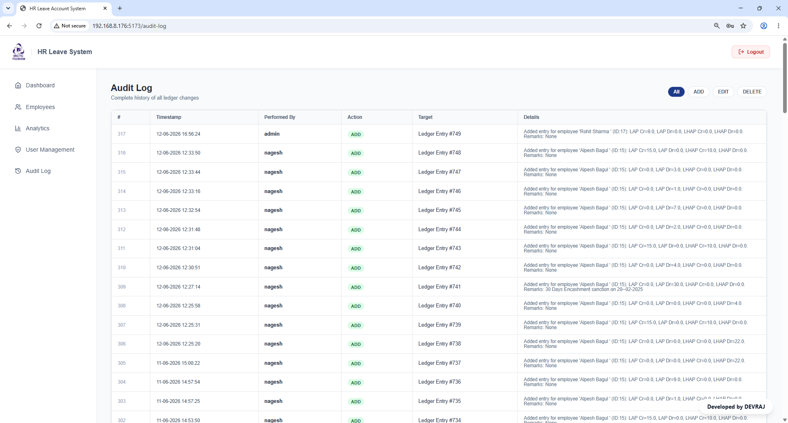
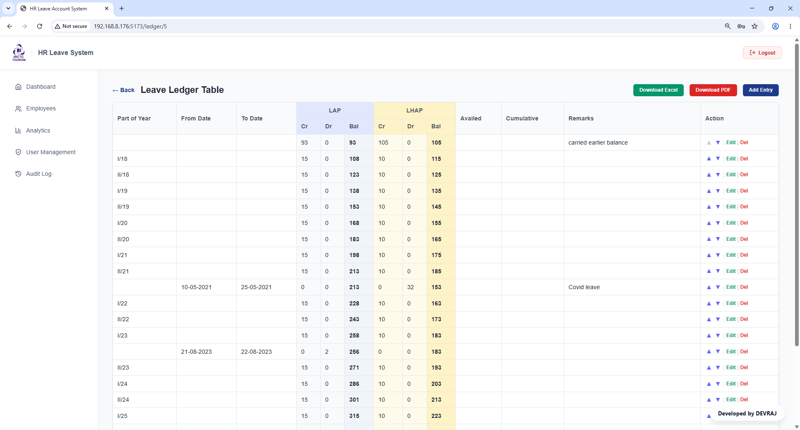

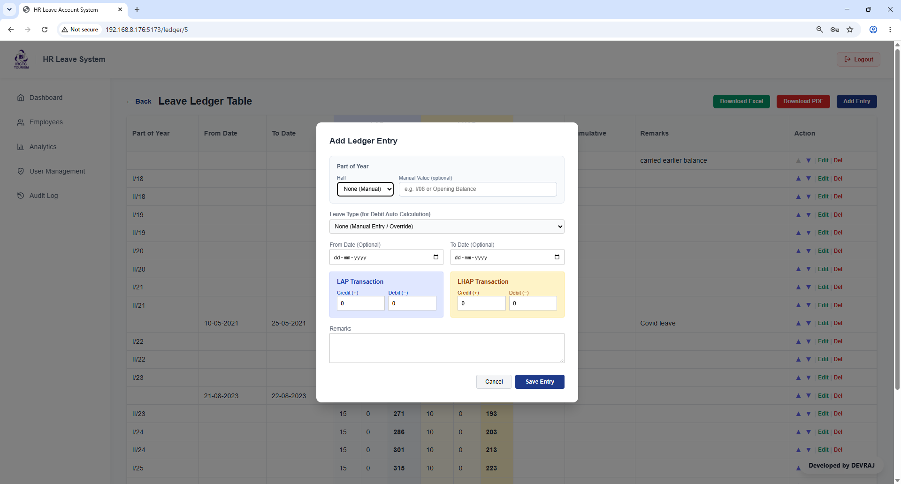
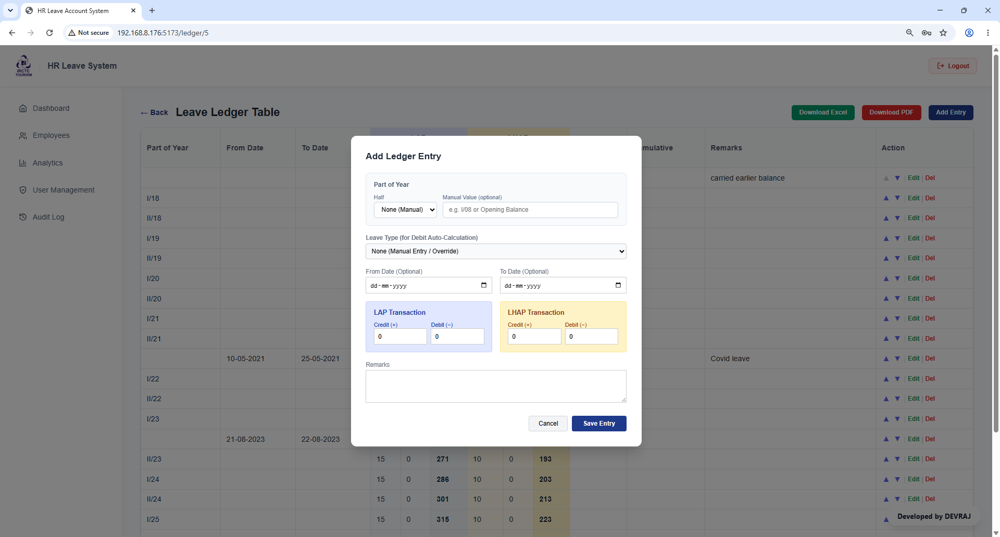
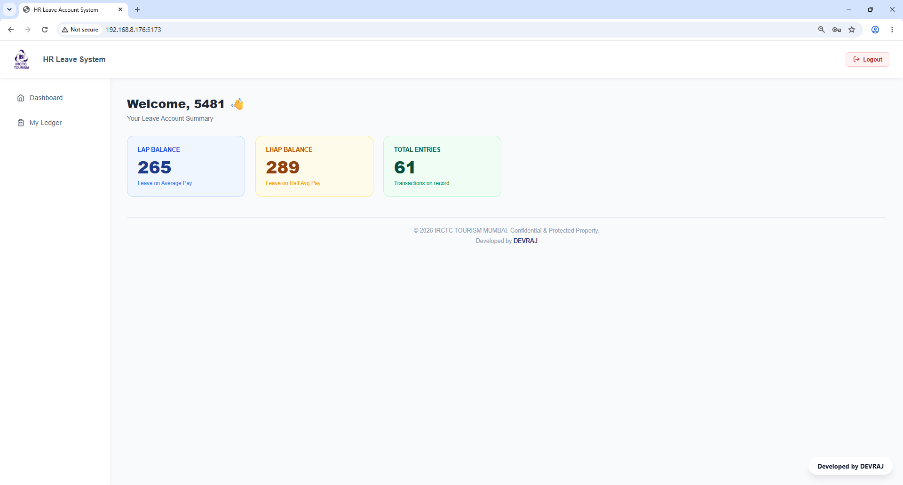
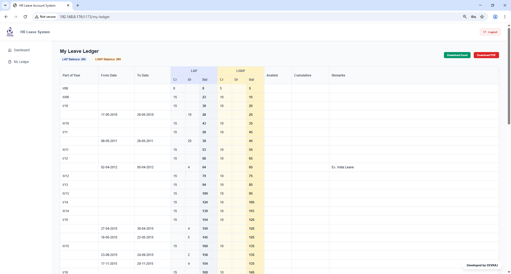

---

# 🤝 Contributing

1. Fork the project
2. Create a feature branch
3. Commit your changes
4. Push branch
5. Open a Pull Request

---

# 📄 License

Distributed under the MIT License.
