# RAILSIGHTS - Passenger Analytics Management (IRCTC)

An enterprise-grade, data-intensive analytics web application engineered for **IRCTC** to provide comprehensive passenger insights, high-speed data querying, and visualization of tourism metrics.

## 🏢 Business Context & Problem Statement
IRCTC possessed massive amounts of historical passenger and booking data spread across legacy CSV files and disjointed databases. Retrieving specific passenger records, generating real-time analytics, and searching across thousands of entries was prohibitively slow using standard SQL queries. There was also a need to enforce strict, granular role-based access control over this sensitive data.

## 🚀 Key Features & Architecture
*   **Distributed Search Architecture**: Implemented a `SearchSyncQueue` to act as an asynchronous broker. When passenger records are modified in PostgreSQL, the backend queues synchronization tasks to Elasticsearch via Redis, ensuring the search index remains accurate without blocking HTTP requests.
*   **Granular Access Control**: Built a highly specific `Permission` schema tying Users to specific modules (`passengers`, `packages`, `reports`, `analytics`) with granular `can_view`, `can_edit`, and `can_delete` flags.
*   **High-Volume Data Ingestion**: Capable of processing large legacy datasets (e.g., parsing massive CSV files). Uses UUIDs across all models to ensure system-wide uniqueness for passenger tracking and booking histories.
*   **Comprehensive Security Auditing**: Features an expansive `AuditLog` and `UserSession` model to track IP addresses, user agents, login durations, and specific administrative actions, providing enterprise-grade security oversight.

## 🛠️ Tech Stack
*   **Frontend:** React 18, Tailwind CSS, Recharts
*   **Backend:** Python (Flask), RESTful APIs & GraphQL (Graphene)
*   **Databases & Search:** PostgreSQL (SQLAlchemy), Elasticsearch (v8), Redis
*   **Infrastructure:** Docker, Docker Compose

# 🖼 Screenshots

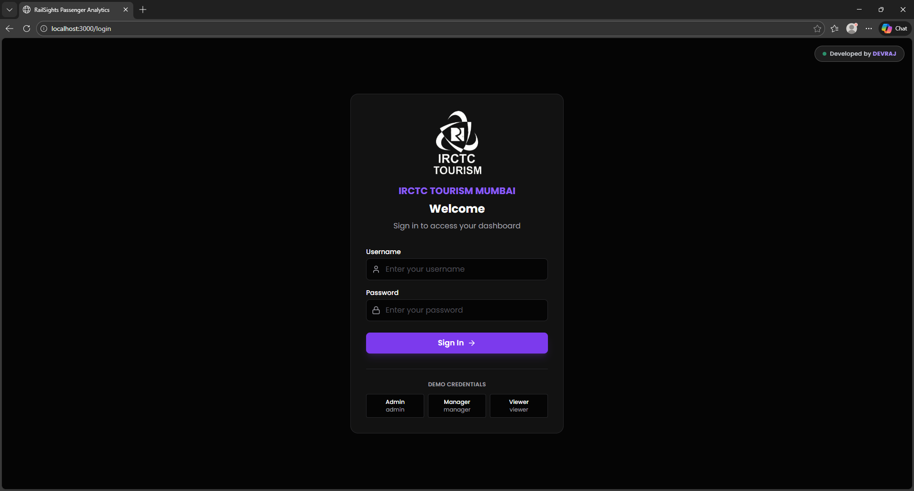
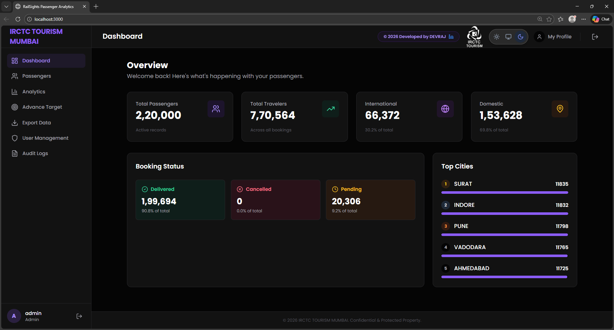
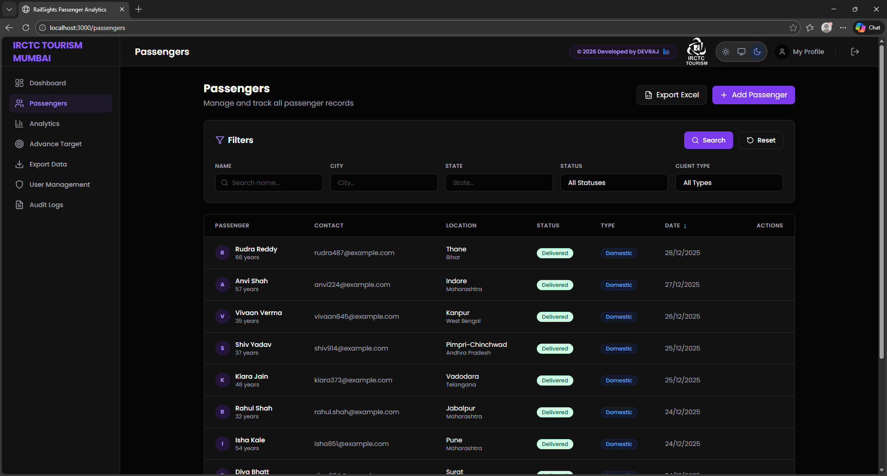
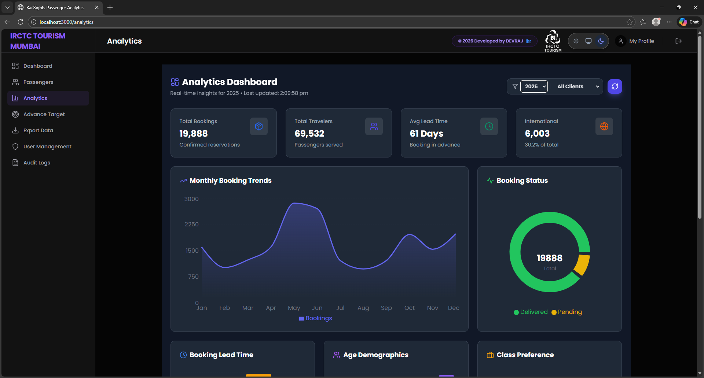
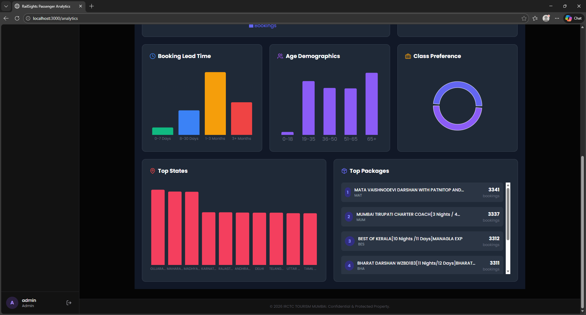
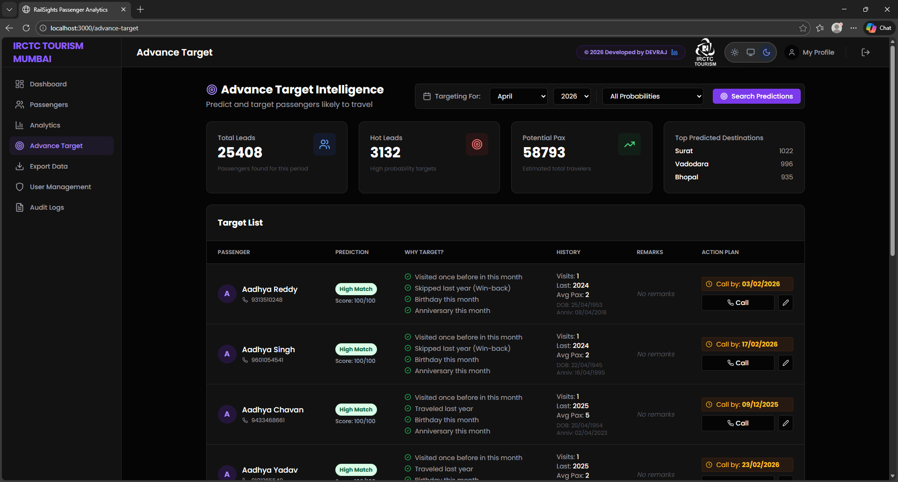
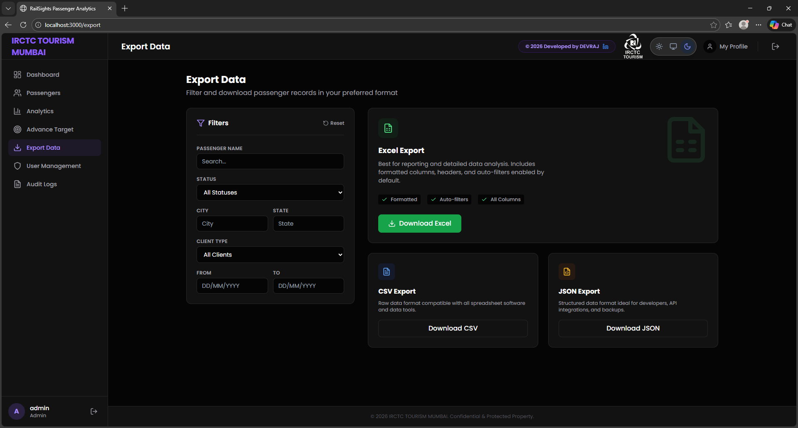
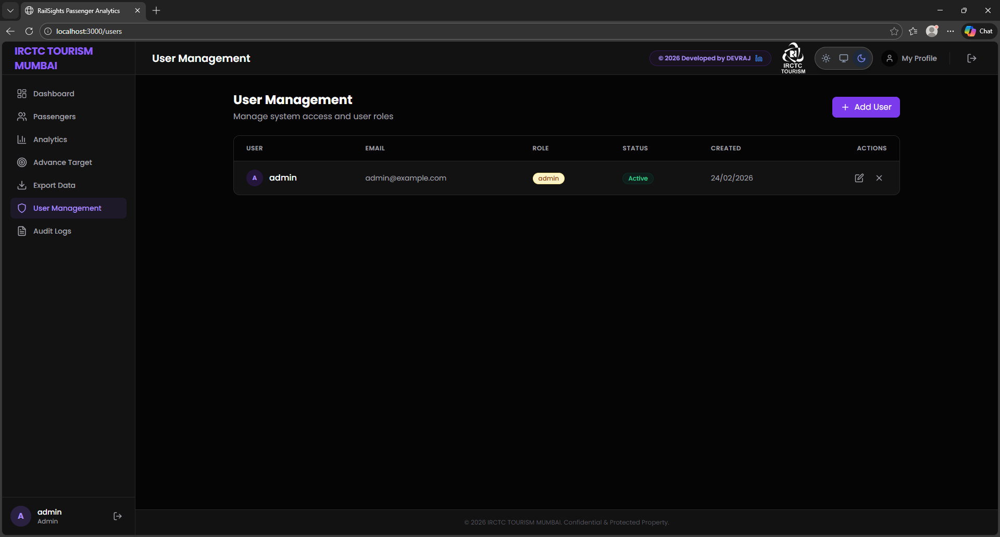
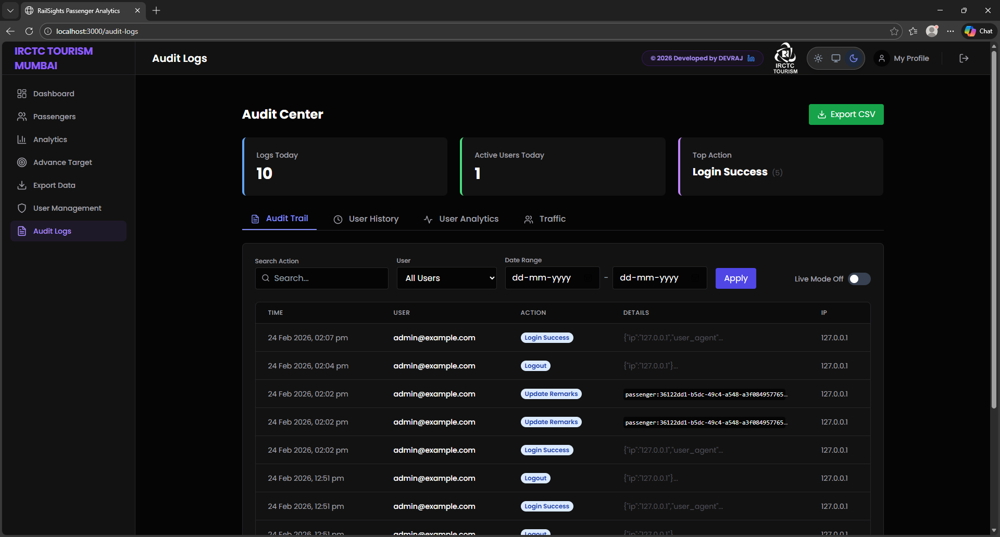
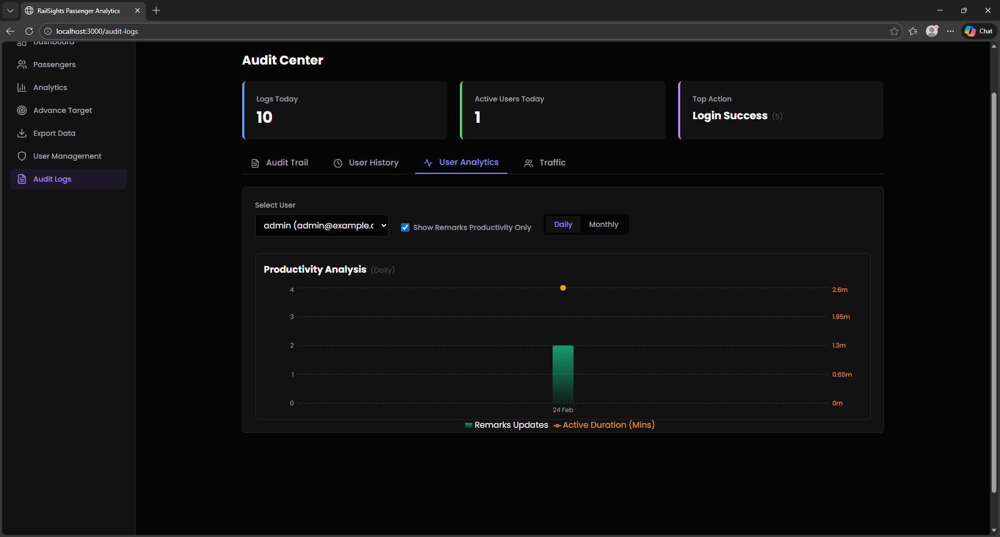
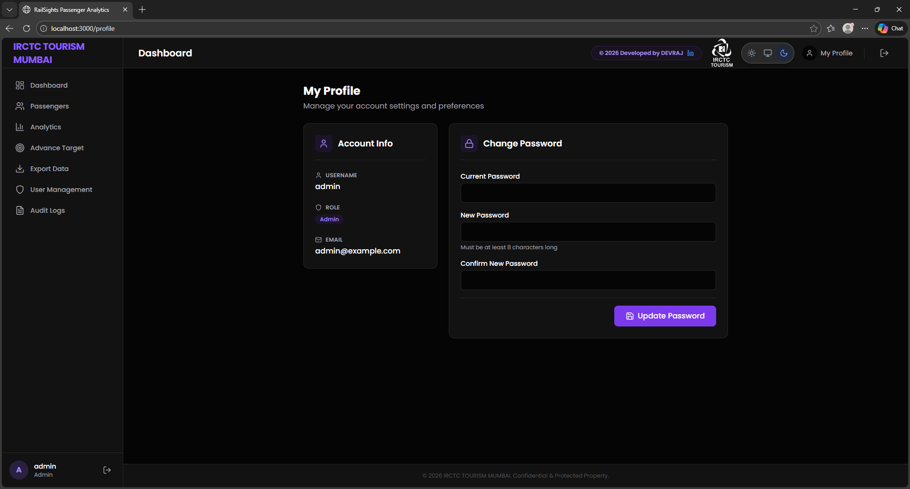

---

# 🤝 Contributing

1. Fork the project
2. Create a feature branch
3. Commit your changes
4. Push branch
5. Open a Pull Request

---

# 📄 License

Distributed under the MIT License.

---
