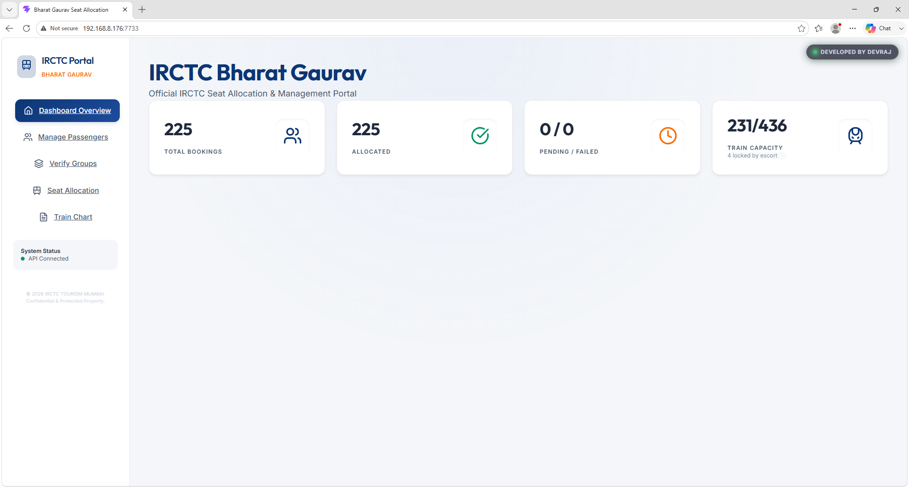
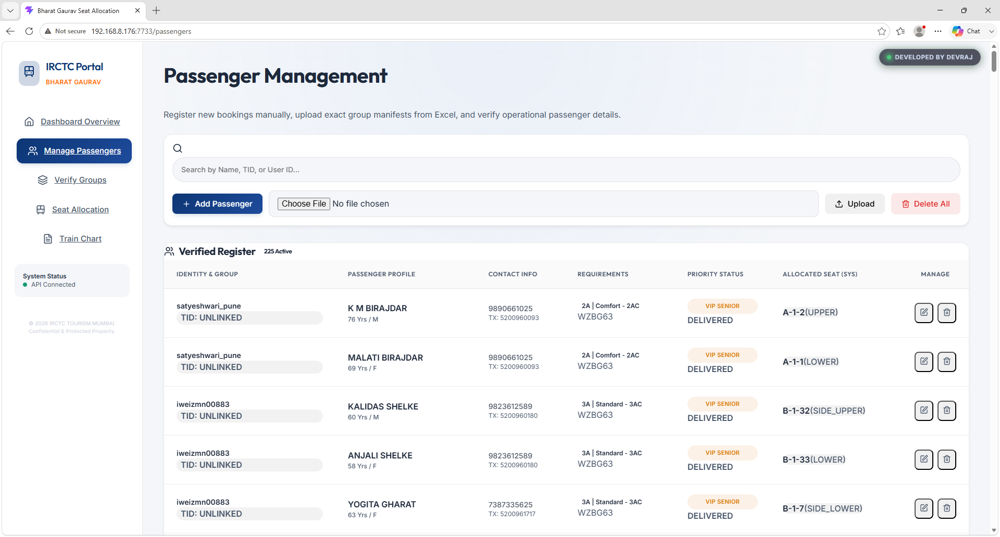
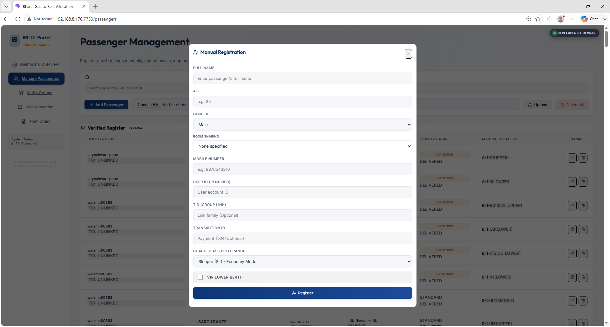
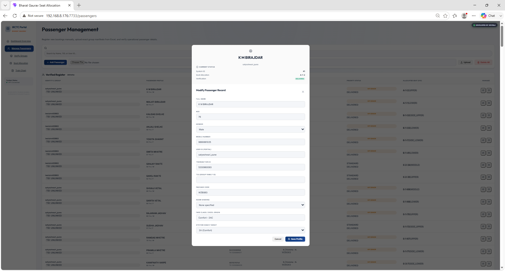
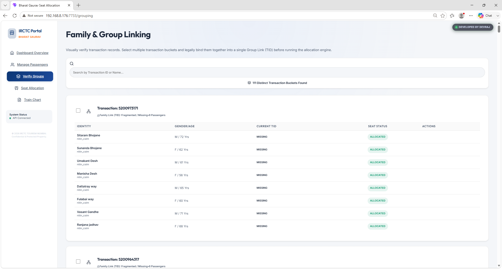
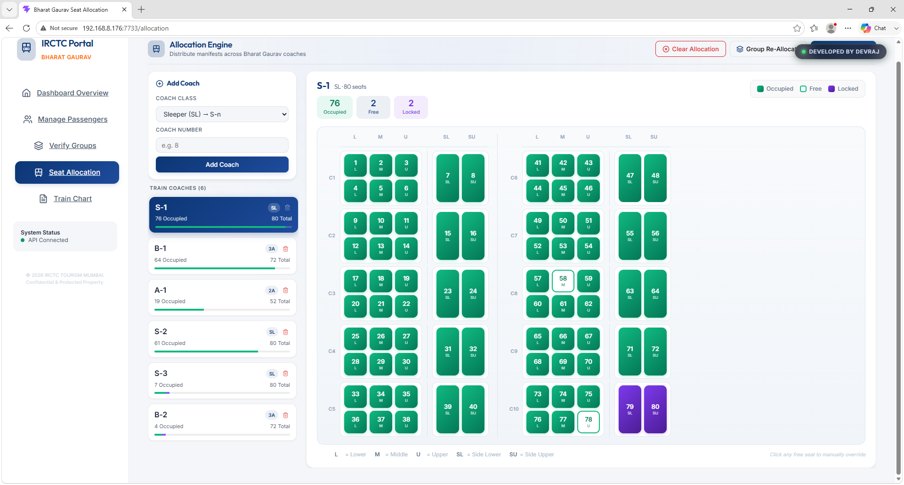
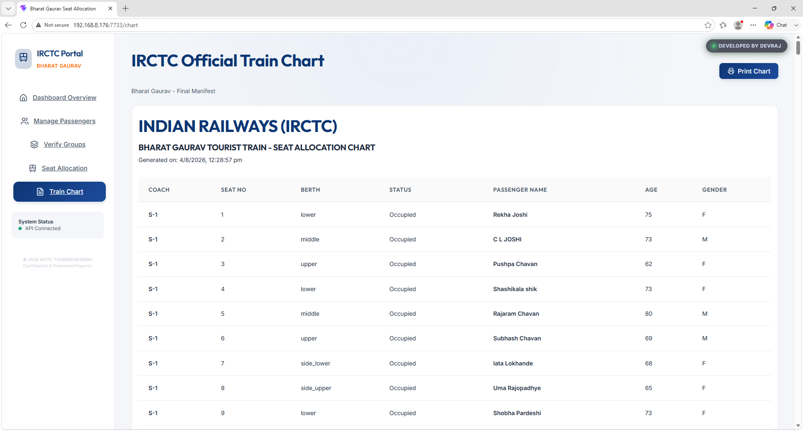

# IRCTC Bharat Gaurav Train - Seat Allocation System

A complex, real-time charting and seat allocation engine engineered specifically for **IRCTC's Bharat Gaurav Tourist Trains**, managing dynamic passenger mapping and live operational updates.

## 🏢 Business Context & Problem Statement
Seat allocation for custom tourist trains involves highly complex constraints: keeping group bookings together, accommodating paid lower berth requests, and reserving specific seats for train escorts/staff. Attempting to manage these constraints and prepare seating charts manually resulted in frequent conflicts, operational bottlenecks, and a lack of real-time visibility. IRCTC required an automated allocation engine capable of processing these dynamic constraints instantly.

## 🚀 Key Features & Architecture
*   **Real-time Charting Engine**: Integrated `python-socketio` seamlessly with a FastAPI ASGI app to push live charting updates to client dashboards via WebSockets without page reloads.
*   **Complex Allocation Logic**: Engineered an algorithm that maps `Passenger` entities to dynamically generated `Seat` entities. It accounts for multiple constraints including group Transaction IDs (TIDs), berth preferences, and escort quota locking.
*   **Dynamic Coach Composition**: The system dynamically generates seats based on the coach type (e.g., Sleeper, 3AC, 2AC), automatically assigning correct berth types (Lower, Middle, Upper, Side Lower/Upper).
*   **Manual Overrides**: Allowed administrators to manually pin passengers to specific seats (surviving auto-reallocations). The automated algorithm gracefully skips over these pinned seats.

## 🛠️ Tech Stack
*   **Frontend:** React.js (Vite)
*   **Backend:** Python (FastAPI), Python-SocketIO
*   **Database:** PostgreSQL (SQLAlchemy ORM)
# 🖼 Screenshots

---

# 🤝 Contributing

1. Fork the project
2. Create a feature branch
3. Commit your changes
4. Push branch
5. Open a Pull Request

---

# 📄 License

Distributed under the MIT License.

---
