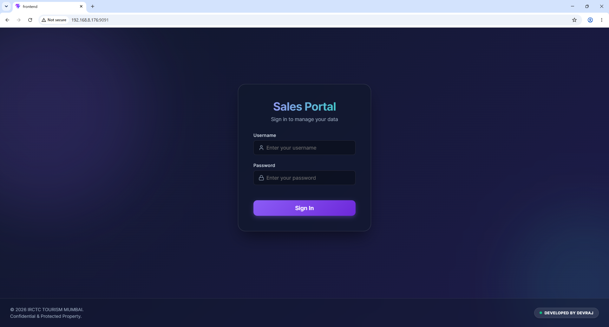
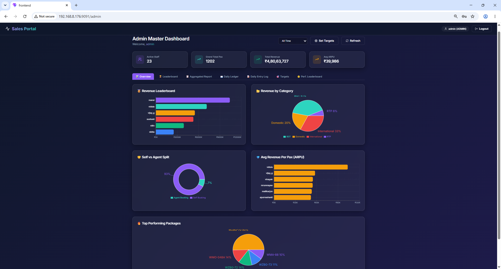
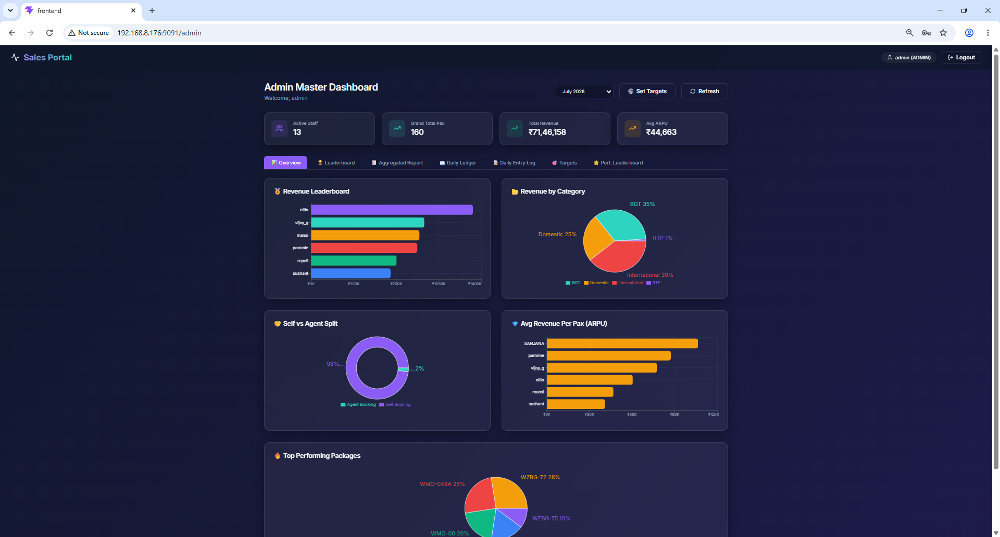
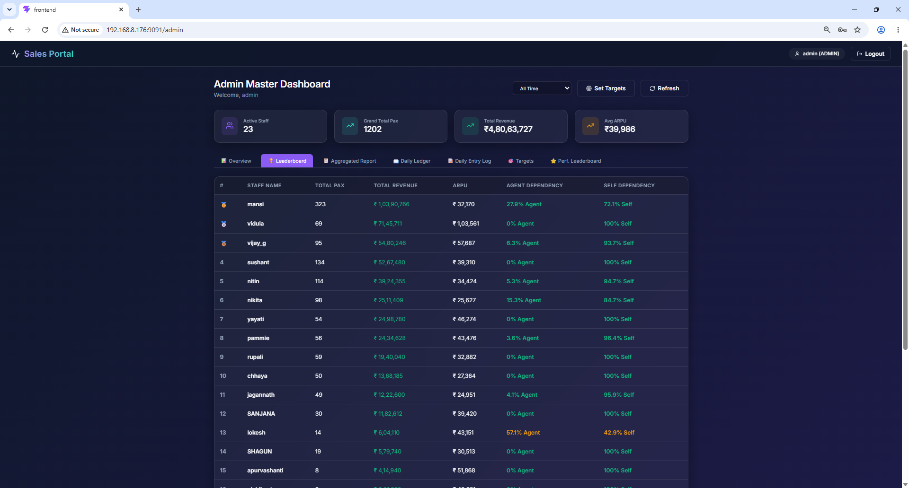
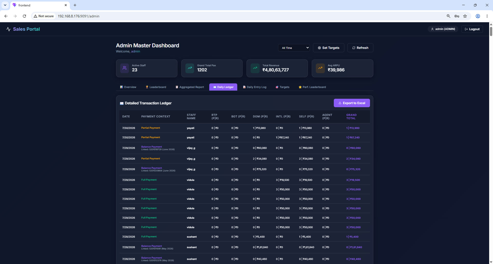
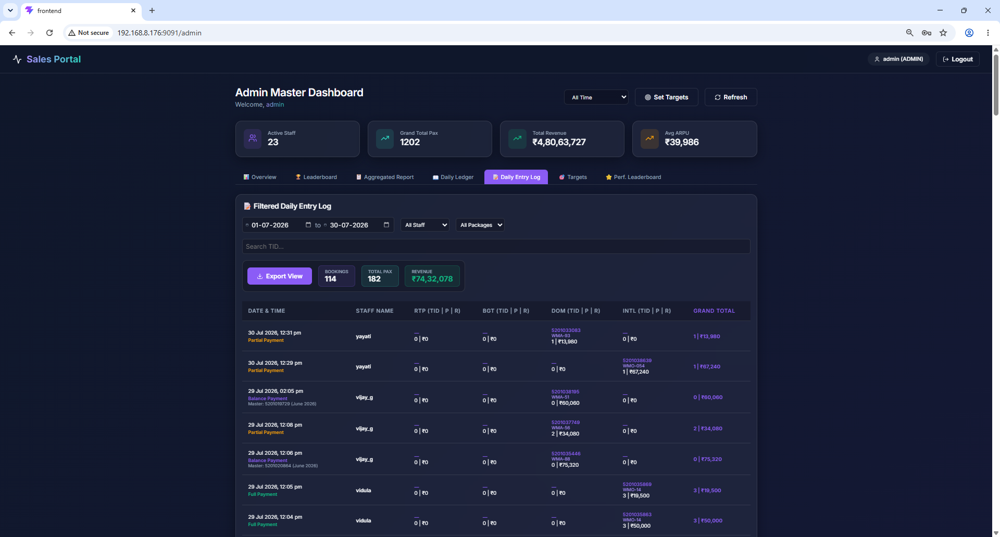
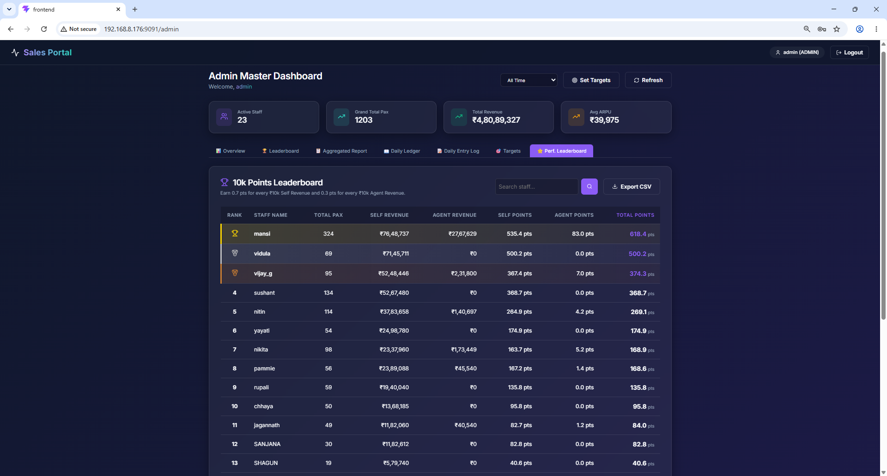
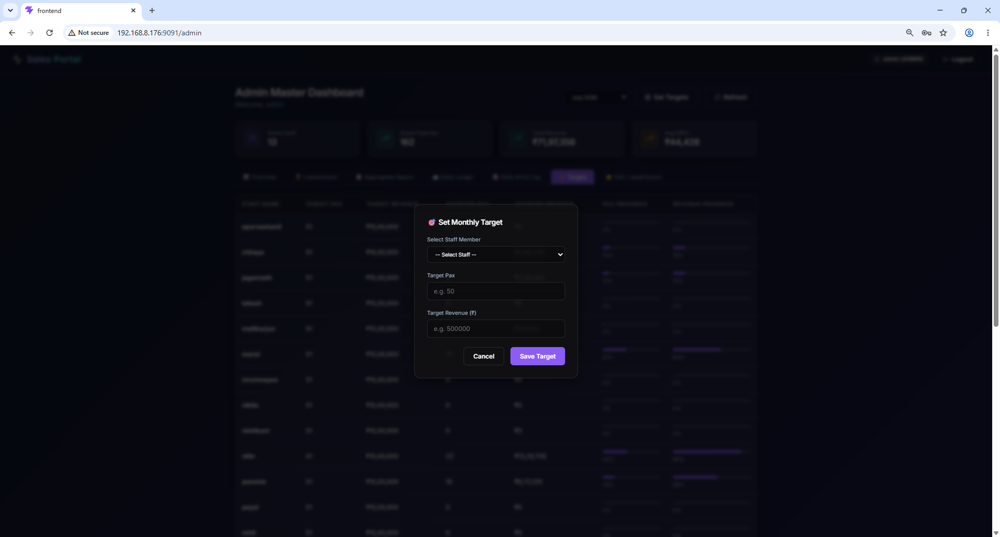
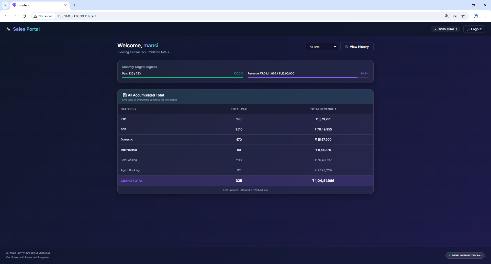

# IRCTC Staff Sales Tracking & Analytics Dashboard

A robust data-entry and analytics platform developed for **IRCTC** to aggregate fragmented daily sales data across multiple tourism verticals into centralized monthly performance dashboards.

## 🏢 Business Context & Problem Statement
Tracking daily sales performance across multiple IRCTC tourism verticals (RTP, BGT, Domestic, International) was previously handled through disparate offline Excel reports. This resulted in fragmented data, making it nearly impossible for management to get a real-time, aggregated view of monthly revenues against assigned targets. Furthermore, validating duplicate transaction IDs was a manual nightmare.

## 🚀 Key Features & Architecture
*   **Transactional Integrity (ACID)**: Built complex PostgreSQL transactions (`BEGIN`/`COMMIT`) in Express.js. Writing to the daily ledger automatically triggers an `UPSERT` to increment running totals in the monthly aggregate table.
*   **Fraud & Duplication Prevention**: Engineered a `used_tids` tracking table that enforces strict uniqueness across all sales transactions, throwing database constraints if staff attempt to log duplicate transaction IDs.
*   **Target Tracking Dashboard**: Allows administrators to assign specific PAX (Passenger) and Revenue goals to individual staff members, with the frontend rendering visual progress bars.
*   **Legacy Data Analysis**: Included a Python `pandas` pipeline for parsing and analyzing offline Excel reports, bridging the gap between old workflows and the new digital dashboard.

## 🛠️ Tech Stack
*   **Frontend:** React.js (Vite)
*   **Backend:** Node.js (Express.js)
*   **Database:** PostgreSQL (`pg` library)
*   **Data Science:** Python, Pandas (for offline Excel analytics)

# 🖼 Screenshots

---

# 🤝 Contributing

1. Fork the project
2. Create a feature branch
3. Commit your changes
4. Push branch
5. Open a Pull Request

---

# 📄 License

Distributed under the MIT License.
